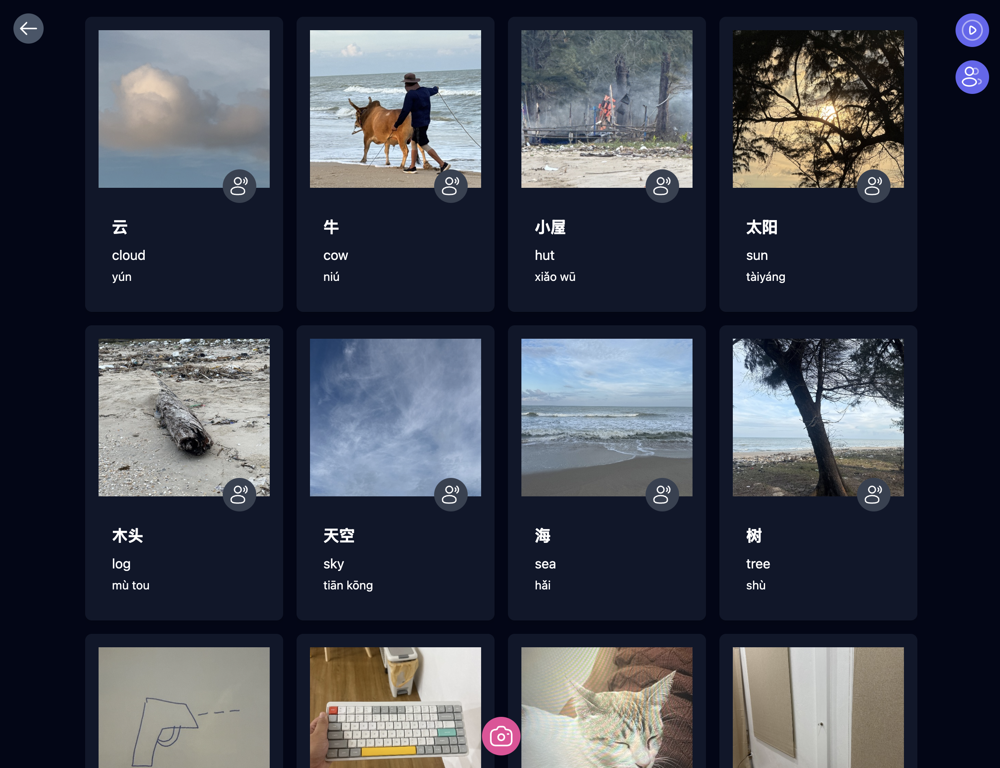

# Flashcard Scavenger Hunt 🌟

A fun and interactive way to learn vocabulary through real-world object recognition and drawing. Try it out at https://flashcard.poom.dev

## Features

- 📸 Take photos of objects to match vocabulary words
- ✏️ Draw pictures when objects aren't available
- 🗣️ Text-to-speech pronunciation
- 🎮 Multiplayer mode for competitive learning
- 🌍 Multi-language support (English, Japanese, Chinese, Vietnamese)
- 🎯 AI-powered image verification
- 🎨 Built-in drawing canvas
- 🎉 Celebratory animations for correct answers

## Screenshots

## Tech Stack

- [Nuxt 3](https://nuxt.com/) - Vue.js Framework
- [PartyKit](https://partykit.io) - Real-time multiplayer functionality
- [Google Cloud Vision AI](https://cloud.google.com/vision) - Image recognition
- [AWS Polly](https://aws.amazon.com/polly/) - Text-to-speech
- [Vue Drawing Canvas](https://github.com/razztyfication/vue-drawing-canvas) - Drawing functionality
- [Tailwind CSS](https://tailwindcss.com/) - Styling

## Self-hosting (WIP)

1. Clone the repository
2. Install dependencies via bun
3. Copy the env file from `.env.example`.
